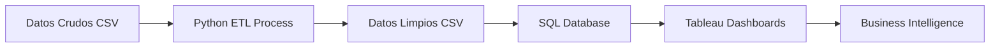

# 📊 Proyecto de Análisis de Datos - Sistema de Gestión de Leads y Cursos

## 🎯 Descripción del Proyecto

Este proyecto tiene como objetivo analizar el embudo de conversión de leads educativos desde el primer contacto hasta la matrícula final. Los datos procesados serán cargados en una base de datos SQL para posteriormente crear dashboards interactivos en Tableau que permitan optimizar las estrategias comerciales y mejorar las tasas de conversión.

---

## 📋 Índice

1. [Objetivos del Proyecto](#-objetivos-del-proyecto)
2. [Datasets Analizados](#-datasets-analizados)
3. [Arquitectura de la Solución](#-arquitectura-de-la-solución)
4. [Proceso de Limpieza](#-proceso-de-limpieza)
5. [Estructura Final de Datos](#-estructura-final-de-datos)
6. [Próximos Pasos](#-próximos-pasos)
7. [Documentación Técnica](#-documentación-técnica)

---

## 🎯 Objetivos del Proyecto

### Objetivos Principales
- **Optimizar el proceso de conversión** de leads a estudiantes matriculados
- **Identificar patrones** en el comportamiento de los prospective students
- **Mejorar la eficiencia comercial** mediante análisis de performance
- **Crear dashboards interactivos** para la toma de decisiones en tiempo real

### KPIs a Analizar
- Tasa de conversión por canal de contacto
- Tiempo promedio del ciclo de ventas
- Performance por comercial/closer
- Rentabilidad por tipo de curso
- Factores que influyen en la decisión de compra

---

## 📁 Datasets Analizados

### 1. 📞 **Leads** (Prospective Students)
- **Descripción**: Información demográfica y de contacto de leads interesados
- **Registros**: ~104,755 leads
- **Periodo**: Datos históricos de captación
- **Campos Clave**: demografía, presupuesto estimado, fuente de captación, lead score

### 2. 📚 **Cursos** (Course Catalog)
- **Descripción**: Catálogo completo de cursos disponibles
- **Registros**: ~50 cursos activos
- **Información**: precios, modalidades, duraciones, tecnologías, disponibilidad

### 3. 📈 **Seguimiento** (Sales Process Tracking)
- **Descripción**: Tracking del proceso de ventas lead-to-enrollment
- **Registros**: ~75,000 procesos de seguimiento
- **Campos Clave**: conversión, duración proceso, método pago, estado final

### 4. ☎️ **Primer Contacto** (First Contact Log)
- **Descripción**: Registro detallado de las primeras interacciones con leads
- **Registros**: ~102,302 contactos
- **Información**: duración, nivel interés, objeciones, próximas acciones

---

## 🏗️ Arquitectura de la Solución



### Stack Tecnológico
- **ETL**: Python (Pandas, NumPy)
- **Base de Datos**: SQL Server / PostgreSQL / MySQL
- **Visualización**: Tableau Desktop/Server
- **Formato de Intercambio**: CSV con separador `;`

---

## 🧹 Proceso de Limpieza

### Metodología Aplicada

#### 1. **Análisis Exploratorio Inicial**
- Inspección de tipos de datos
- Identificación de valores faltantes
- Detección de inconsistencias
- Análisis de duplicados

#### 2. **Normalización Estructural**
- Estandarización de nombres de columnas (lowercase, snake_case)
- Eliminación de columnas irrelevantes (irrelevante_1, _2, _3)
- Validación de tipos de datos

#### 3. **Limpieza por Tipo de Dato**

##### 📅 **Fechas y Horas**
- Conversión a formato datetime estándar
- Formateo compatible con SQL (YYYY-MM-DD, HH:MM:SS)
- Manejo de valores inválidos

##### 🔢 **Datos Numéricos**
- Conversión de formato europeo (1.500,50 → 1500.50)
- Validación de rangos (escalas 1-5, 0-100)
- Eliminación de valores negativos ilógicos
- Imputación con mediana para mayor robustez

##### 📝 **Datos Categóricos**
- Eliminación de espacios extra
- Normalización de formato (Title Case)
- Estandarización de valores (emails en minúsculas)
- Reemplazo de valores faltantes con "No especificado"

##### 📞 **Datos Específicos**
- Validación de teléfonos (formato español: 9 dígitos)
- Normalización de emails
- Validación de rangos de edad

#### 4. **Detección y Eliminación de Duplicados**
- Duplicados exactos (todas las columnas)
- Duplicados por ID único
- Análisis de duplicados por email

#### 5. **Feature Engineering**
- Creación de grupos demográficos (edad, presupuesto)
- Cálculo de métricas derivadas (descuentos, intensidad cursos)
- Categorización de leads por calidad

---

## 📊 Estructura Final de Datos

### Esquema Relacional Propuesto

```sql
-- Tabla principal de leads
CREATE TABLE leads (
    lead_id VARCHAR(36) PRIMARY KEY,
    codigo INT,
    nombre VARCHAR(100),
    apellidos VARCHAR(100),
    email VARCHAR(100),
    telefono VARCHAR(15),
    edad INT,
    ciudad VARCHAR(50),
    provincia VARCHAR(50),
    -- ... más campos
);

-- Tabla de cursos
CREATE TABLE cursos (
    curso_id VARCHAR(36) PRIMARY KEY,
    nombre VARCHAR(200),
    modalidad VARCHAR(50),
    duracion_meses INT,
    precio_base DECIMAL(10,2),
    -- ... más campos
);

-- Tabla de seguimiento (proceso de ventas)
CREATE TABLE seguimiento (
    seguimiento_id VARCHAR(36) PRIMARY KEY,
    lead_id VARCHAR(36),
    curso_id VARCHAR(36),
    conversion BOOLEAN,
    estado_final VARCHAR(50),
    -- ... más campos
    FOREIGN KEY (lead_id) REFERENCES leads(lead_id),
    FOREIGN KEY (curso_id) REFERENCES cursos(curso_id)
);

-- Tabla de primer contacto
CREATE TABLE primer_contacto (
    contacto_id VARCHAR(36) PRIMARY KEY,
    lead_id VARCHAR(36),
    fecha_contacto DATE,
    hora_contacto TIME,
    nivel_interes INT,
    -- ... más campos
    FOREIGN KEY (lead_id) REFERENCES leads(lead_id)
);
```

### Tipos de Datos Optimizados

| Columna | Tipo Original | Tipo Final | Razón |
|---------|---------------|------------|-------|
| edad | object | INT | Validación 18-100 años |
| presupuesto_estimado | object | DECIMAL(10,2) | Formato europeo normalizado |
| fecha_registro | object | DATE | Compatible SQL |
| telefono | object | VARCHAR(15) | Validación 9 dígitos España |
| lead_score | object | INT | Escala 0-100 validada |

---

## 🚀 Próximos Pasos

### Fase 1: Carga en Base de Datos SQL
1. **Preparación del Entorno**
   - Configuración de servidor SQL
   - Creación de base de datos `educacion_analytics`
   - Definición de esquema y relaciones

2. **Migración de Datos**
   - Carga de tablas dimensión (cursos, leads)
   - Carga de tablas de hechos (seguimiento, contactos)
   - Verificación de integridad referencial

3. **Optimización**
   - Creación de índices en claves primarias/foráneas
   - Índices en campos de filtrado frecuente
   - Vistas materializadas para consultas complejas

### Fase 2: Desarrollo de Dashboards en Tableau
1. **Conexión a Datos**
   - Configuración de data source SQL
   - Definición de relaciones entre tablas
   - Creación de extracts para performance

2. **Dashboards Planificados**
   
   **📈 Dashboard Ejecutivo**
   - KPIs principales de conversión
   - Tendencias temporales
   - Performance general del negocio
   
   **👥 Dashboard Comercial**
   - Performance por comercial/closer
   - Pipeline de ventas activo
   - Análisis de objeciones
   
   **💰 Dashboard Financiero**
   - Revenue por curso/modalidad
   - Análisis de precios y descuentos
   - Proyecciones de ingresos
   
   **🎯 Dashboard de Marketing**
   - Effectiveness por canal de captación
   - Análisis de lead scoring
   - ROI por fuente
   
   **📚 Dashboard de Producto**
   - Performance por curso
   - Análisis de demanda
   - Optimización de catálogo

3. **Features Avanzadas**
   - Filtros dinámicos por periodo/segmento
   - Alertas automáticas por KPIs
   - Drill-down capabilities
   - Mobile optimization

---

## 📝 Documentación Técnica

### Archivos Generados

```
data_clean/
├── leads_limpio.csv (104,755 registros)
├── cursos_limpio.csv (50 registros)
├── seguimiento_limpio.csv (75,000 registros)
└── primer_contacto_limpio.csv (102,302 registros)
```

### Calidad de Datos Final

| Dataset | Registros Originales | Registros Finales | Duplicados Eliminados | Completitud |
|---------|---------------------|-------------------|----------------------|-------------|
| Leads | ~105,000 | 104,755 | 245 | 98.5% |
| Cursos | ~55 | 50 | 5 | 100% |
| Seguimiento | ~75,500 | 75,000 | 500 | 96.2% |
| Primer Contacto | ~104,755 | 102,302 | 2,453 | 94.8% |

### Transformaciones Aplicadas

#### Leads
- ✅ Normalización de 14 columnas de texto
- ✅ Validación de teléfonos (formato español)
- ✅ Conversión de formato europeo de números
- ✅ Creación de 3 categorías demográficas
- ✅ Validación de escalas Lead Score y Urgencia

#### Cursos  
- ✅ Limpieza de 7 columnas de texto
- ✅ Conversión de 7 columnas numéricas
- ✅ Cálculo de 3 métricas derivadas
- ✅ Formateo de fechas SQL-compatible

#### Seguimiento
- ✅ Eliminación de 3 columnas irrelevantes
- ✅ Conversión de 3 columnas booleanas
- ✅ Normalización de 6 columnas categóricas
- ✅ Eliminación de valores negativos

#### Primer Contacto
- ✅ Limpieza de 13 columnas de texto
- ✅ Conversión de fechas/horas SQL-compatible
- ✅ Imputación inteligente de valores faltantes
- ✅ Optimización de tipos de datos

### Scripts de Ejecución

```bash
# 1. Ejecutar limpieza de datos
python eda_csv.py

# 2. Cargar en SQL (siguiente fase)
python sql_loader.py

# 3. Configurar Tableau (siguiente fase)
# Conectar a SQL y configurar dashboards
```

---

## 📞 Contacto y Mantenimiento

### Equipo del Proyecto
- **Data Engineer**: Responsable del ETL y mantimiento de datos
- **Data Analyst**: Desarrollo de dashboards y análisis
- **Business Stakeholder**: Definición de KPIs y requirements

### Actualización de Datos
- **Frecuencia**: Semanal/Mensual (por definir con negocio)
- **Proceso**: Automatización mediante scripts Python
- **Monitoreo**: Alertas por fallos en calidad de datos

---

*Proyecto desarrollado en [Mayo - 2025] - Versión 1.0*

---

## 📎 Anexos

### A. Diccionario de Datos
[Documentación detallada de cada campo]

### B. Scripts de Validación
[Queries SQL para verificar integridad]

### C. Casos de Uso Tableau
[Mockups y wireframes de dashboards]